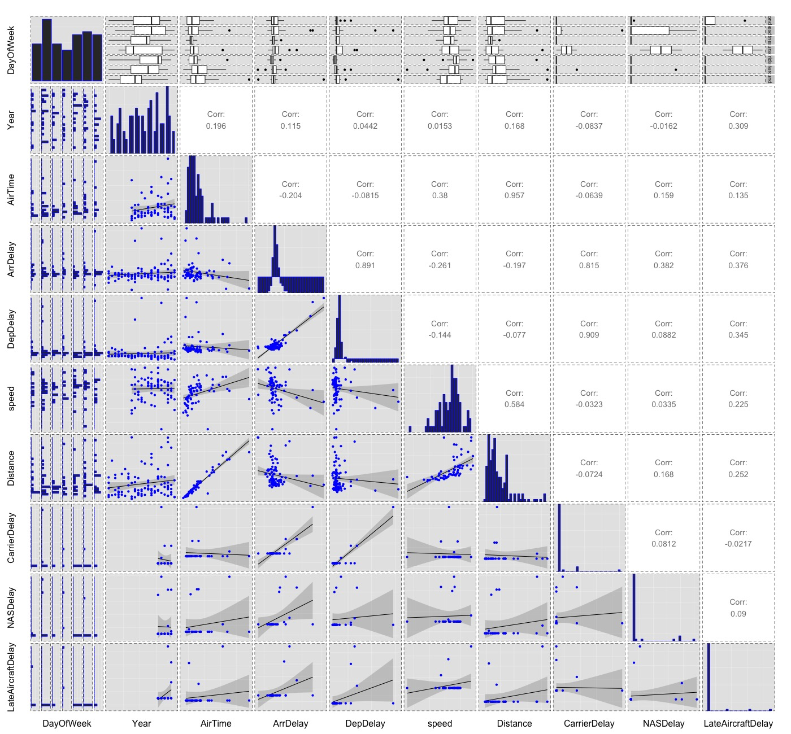

<style type="text/css">

#TOC {
  position: fixed;
  left: 0;
  top: 0;
  width: 250px;
  height: 100%;
  overflow:auto;
}
#TOC ul li a {
  color: #777;
}
body {
  max-width: 1600px;
  margin: auto;
  margin-left:260px;
  line-height: 20px;
}
</style>

[Github Source Code](https://github.com/mic0331/udacity_nanodegree/tree/master/P3)

```{r echo=FALSE, message=FALSE, warning=FALSE, fig.width = 9, packages}

knitr::opts_chunk$set(echo=FALSE, warning=FALSE, message=FALSE)

#install.packages("RSQLite")  # if needed
#install.packages("freqweights") # if needed
#install.packages('reshape2') # if needed
#install.packages("ggmap") # if needed

library(knitr)
library(dplyr)
library(reshape2)
require(ggplot2)
library(gridExtra)
library(grid)
library(scales)
library(freqweights)
library(maps)
library(GGally)
library(lubridate)

opts_knit$set(root.dir = '/Users/mic0331/Documents/TRAINING/Data Analysis/Courses/Nanodegree Data Analyst/Projects/udacity_nanodegree/P3/data')
```

# Introduction

## Abstract

Taking an airplane is one of the most important and efficient ways to travel. 
However, many travelers have experienced delayed flight. Which airline carriers 
delayed most often? Which airports have highest probability to make you wait for 
a long time? Also, which day of week and which month of year are better for your 
journey without severe delay?

The aim of this presentation is to produce a graphical summary of the airline 
performance data. 

For this project, we will be exploring the airline on-time performance from a 
publicly available dataset from the stat-computing website (see reference at 
the end of this document).

## The dataset

The data consists of flight arrival and departure details for all commercial 
flights within the USA, from October 1987 to April 2008. 

The dataset is packed in a yearly chunks from 1987 to 2008.  This is a large 
dataset: there are nearly 120 million records in total, and takes up 1.6 
gigabytes of space compressed and 12 gigabytes when uncompressed. 

To make sure we will be not overwhelmed by the size of the data, we will create 
a subset file that will be used for our Exploratory Data Analysis task.

For a deeper exaplanation about the data preparation and the SQL code, please 
refer to [this page](Data_preparation.html) where every steps are explained 
in details.

```{r}
rita = read.csv('./rita.csv')
dim(rita)
# also lead other utilitiy files
airports = read.csv('./airports.csv')
carriers = read.csv('./carriers.csv')
```

There are 800,000 flights from 1997 till 2008 with 32 features.

```{r}
str(rita)
```

The data comes originally from 
[RITA](http://www.transtats.bts.gov/OT_Delay/OT_DelayCause1.asp) 
where it is 
[described in detail](http://www.transtats.bts.gov/Fields.asp?Table_ID=236).

Here is a summary of these features:

```{r}
columns = read.csv('./columns.csv', sep=";")
columns
```

Two features has been built on top of the existing to facilitate the 
exploration exercice.

First, the feature `speed` has been created, the calculation behind this variable 
is very simple, we take the distance and divide by the `AirTime` (flight time) 
variable (in hours).  This give us the speed in miles / hour.  

Next, the feature `date` has also been created to simply reflect the departure 
date in a date format.  We use this format because the data set only offer the 
data as three separate features (Year, Month, DayOfMonth)

```{r}
# We adjust the date features formats
rita$Month <- sprintf("%02d", rita$Month)
rita$DepTime <- sprintf("%04d", rita$DepTime)
rita$ArrTime <- sprintf("%04d", rita$ArrTime)
rita$DayOfWeek <- sprintf("%02d", rita$DayOfWeek)
rita$DayofMonth <- sprintf("%02d", rita$DayofMonth)

# speed in miles / hour
rita <- mutate(rita, speed = Distance / (AirTime / 60))

# full date of the departure
rita <- mutate(rita, date = as.Date(paste(rita$Year, rita$Month, 
                                          rita$DayofMonth, sep=""), "%Y%m%d"))
```

Note: 

  - Reason for cancellation can take 4 possible value (A = carrier, B = weather, 
  C = NAS, D = security).
  
  - We have 29 carriers in the dataset.
  
  - We have 335 destination airports and 333 origin airports.

# Plotting delayed, cancelled, on-time, boarding ... Flying in the USA

## Range analysis

It is effective to devide the numeric variable into the ordered, reasonable 
range for our analysis. So we split the `Distance, ArrDelay, Airtime, 
CRSDepTime, CRSArrTime` respectively and make sure that all the observation is 
included in given range.

The split of the data is made based on the observation of the output from the
`summary` command.  This commande provide the five-number summary, a concise 
summary of the distribution of the observations.  With that we have an 
information about the location (from the median), the spread (from the 
quartiles) and the range (from the sample minimum and maximum) of the 
observations.

```{r}
data = rita
```

1/ Distance of flights in miles

```{r, echo=TRUE}
summary(rita$Distance)
```

The data distribution is left (positive) skewed.  We can see that the mean is 
larger than the median.

```{r}
data$Distance = ordered(cut(data$Distance, c(0, 300, 600, 1000, Inf)), 
                        labels = c("Short", "Medium", "Long", "Too long"))

ggplot(data, aes(x=Distance)) +
  geom_histogram(fill="lightblue") +
  theme_bw()
```

Most flights are coverining medium distance.  The number of long and short 
distance are comparable.

2/ Arrival delays in minutes

```{r, echo=TRUE}
summary(rita$ArrDelay)
```

```{r}
data$ArrDelay = ordered(cut(data$ArrDelay, c(0, 25, 50, 80, Inf)), 
                        labels = c("On-Time", "Delayed", "Intermediate-Delayed",
                                   "Much-Delayed"))

ggplot(data, aes(x=ArrDelay)) +
  geom_histogram(fill="lightblue") +
  theme_bw()
```

Besides the NA values, most of the flights land on-time.
We have 16745 NA's in the dataset for this variable. 

3/ Flight time

```{r, echo=TRUE}
summary(rita$AirTime)
```

```{r}
data$AirTime = ordered(cut(data$AirTime, c(-1, 50, 100, 200, 300, Inf)), 
                       labels = c("Too-Short", "Short", "Intermediate", 
                                  "Long", "Too-Long"))

ggplot(data, aes(x=AirTime)) +
  geom_histogram(fill="lightblue") +
  theme_bw()
``` 

Most flight are short in time (less than an hour) or intermediate (from one to 
2 hours); long flight (more than 3 hours) are less frequent.

4/ Scheduled departure time (CRS is the Computer Reservation System) 

```{r, echo=TRUE}
summary(rita$CRSDepTime)
```

```{r}
data$CRSDepTime = ordered(cut(data$CRSDepTime, c(-1, 600, 1200, 1800, Inf)), 
                          labels = c("Overnight", "Morning", "Afternoon", 
                                     "Evening"))

ggplot(data, aes(x=CRSDepTime)) +
  geom_histogram(fill="lightblue") +
  theme_bw()
```

Most of the flights are scheduled during the morning or afternoon and less 
frequently the evening.

5/ Scheduled arrival time (CRS is the Computer Reservation System) 

```{r, echo=TRUE}
summary(rita$CRSArrTime)
```

```{r}
data$CRSArrTime = ordered(cut(data$CRSArrTime, c(-1, 600, 1200, 1800, 2359)), 
                          labels = c("Overnight", "Morning", "Afternoon", 
                                     "Evening"))

ggplot(data, aes(x=CRSArrTime)) +
  geom_histogram(fill="lightblue") +
  theme_bw()
```

Most flights land the afternoon and the evening.  This make sence based on the 
previous histogram.

## Airline companies

```{r, fig.height=10, fig.width=10}
merged.data <- merge(data, carriers, by.x="UniqueCarrier", by.y="Code")

qplot(x = UniqueCarrier, data = merged.data, fill = Description) +
  theme_bw() +
  coord_flip() +
  xlab(NULL) +
  guides(fill=guide_legend(ncol=2)) +
  theme(legend.position="bottom", legend.direction = "horizontal")
```

The chart show major US airlines (in number of flights), 
we can see major companies such American Airlines, Delta, United.

## Flight volume

Let's show the number of flight (flight volume) we have per year.

```{r}
ggplot(rita, aes(x = Year)) + 
  geom_histogram(fill="lightblue", binwidth=1, col="black") +
  labs(title = "Distribution of flight per year") + 
  xlab('Year') +
  theme_bw()
```

We see from this plot a continuity in the growth of number of flight.  There are
less flight in the 80th than in the 2008.  This is algin with a logical thinking
and also the size of the files used to load the database.  The file for 1987 is 
smaller than other, this is also proven in the histogram.
With that we can assume the random selection of the sample has been made 
correctly and we are not privileging a year over another.

The next line graph show the same thing in a different way.

```{r}
rita.rita_per_year <- rita %>%
  group_by(Year) %>%
  summarise(n = n()) %>%
  arrange(Year)

ggplot(rita.rita_per_year) +
  geom_point(aes(x=Year, y=n)) +
  geom_line(aes(x=Year, y=n), col = "lightblue") +
  scale_x_continuous(limits = c(1987, 2008), breaks = seq(1987, 2008, 5)) +
  ylab("Count") +
  theme_bw() +
  theme(
    panel.grid.major.y = element_line(colour = "black", linetype = 3, size = .5),
    panel.background = element_blank(),
    axis.title.x = element_text(size=16),
    axis.text.x = element_text(size=14, angle=45, hjust=1, vjust=1),
    axis.title.y = element_text(size=16, angle = 90),
    axis.text.y = element_text(size=14),
    strip.background = element_rect(color="white", fill="white"),
    strip.text = element_text(size=16)
  )
```

We see a drop in the number of fligh between 2001 and 2003, probably due to the 
event of September 11, 2001, however, flight volume is on the increase - 
dramatically so since 2000.

## Delays Arrival / Departure

Let's now focus the analysis on the delays.
The next four plots are showing on the left the number (up) and the density 
(down) of departure delay and on the right the same for arrival delay.

```{r, message=FALSE, warning=FALSE}
p1 <- ggplot(rita, aes(x=DepDelay / 60)) +
  geom_histogram(fill="lightblue", binwidth=.1) + 
  scale_x_continuous(limits = c(-2, 2), breaks = seq(-2, 2, 1)) +
  geom_vline(aes(xintercept=mean(DepDelay / 60, na.rm=T)),   # Ignore NA values for mean
               color="red", linetype="dashed", size=.5) +
  geom_vline(aes(xintercept=median(DepDelay / 60, na.rm=T)),   # Ignore NA values for median
               color="green", linetype="dashed", size=.5) +
  xlab('Departure Delays (hours)') +
  theme_bw()

p2 <- ggplot(rita, aes(x=ArrDelay / 60)) +
  geom_histogram(fill="lightblue", binwidth=.1) + 
  scale_x_continuous(limits = c(-2, 2), breaks = seq(-2, 2, 1)) +
  geom_vline(aes(xintercept=mean(ArrDelay / 60, na.rm=T)),   # Ignore NA values for mean
               color="red", linetype="dashed", size=.5) +
  geom_vline(aes(xintercept=median(ArrDelay / 60, na.rm=T)),   # Ignore NA values for median
               color="green", linetype="dashed", size=.5) +
  xlab('Arrival Delays (hours)') +
  theme_bw()

p3 <- ggplot(rita, aes(x=DepDelay / 60)) +
  geom_histogram(fill="lightblue", binwidth=.1, aes(y = ..density..), 
                 color = "black") + 
  geom_density(color="black") +
  scale_x_continuous(limits = c(-2, 2), breaks = seq(-2, 2, 1)) +
  geom_vline(aes(xintercept=mean(DepDelay / 60, na.rm=T)),   # Ignore NA values for mean
               color="red", linetype="dashed", size=.5) +
  geom_vline(aes(xintercept=median(DepDelay / 60, na.rm=T)),   # Ignore NA values for median
               color="green", linetype="dashed", size=.5) +
  xlab('Departure Delays (hours)') +
  theme_bw()

p4 <- ggplot(rita, aes(x=ArrDelay / 60)) +
  geom_histogram(fill="lightblue", binwidth=.1, aes(y = ..density..), 
                 color = "black") + 
  geom_density(color="black") +
  scale_x_continuous(limits = c(-2, 2), breaks = seq(-2, 2, 1)) +
  geom_vline(aes(xintercept=mean(ArrDelay / 60, na.rm=T)),   # Ignore NA values for mean
               color="red", linetype="dashed", size=.5) +
  geom_vline(aes(xintercept=median(ArrDelay / 60, na.rm=T)),   # Ignore NA values for median
               color="green", linetype="dashed", size=.5) +
  xlab('Arrival Delays (hours)') +
  theme_bw()

grid.arrange(p1, p2, p3, p4, ncol = 2)
```

We see that most flight have no delays.  The distribution for the departure 
seems a bit negatively skewed compare to arrival where the distribution is normal.

```{r, message=FALSE, warning=FALSE, fig.height=10}
rita.no_missing <- filter(rita, !is.na(DepDelay) & !is.na(ArrDelay))
rita.by_year <- group_by(rita.no_missing, Year)

# the *1.0 is used to avoid loss of precision when attemting to convert a 
# numeric to an integer

rita.DepDelays <- summarise(rita.by_year,
                    mean = mean(DepDelay, na.rm = TRUE),
                    median = median(DepDelay * 1.0, na.rm = TRUE),
                    q75 = quantile(DepDelay, .75, na.rm = TRUE),
                    q25 = quantile(DepDelay, .25, na.rm = TRUE),
                    over_15 = mean(DepDelay > 15, na.rm = TRUE),
                    over_30 = mean(DepDelay > 30, na.rm = TRUE),
                    over_60 = mean(DepDelay > 60, na.RM = TRUE))

rita.ArrDelays <- summarise(rita.by_year,
                    mean = mean(ArrDelay, na.rm = TRUE),
                    median = median(ArrDelay * 1.0, na.rm = TRUE), 
                    q75 = quantile(ArrDelay, .75, na.rm = TRUE),
                    q25 = quantile(ArrDelay, .25, na.rm = TRUE),
                    over_15 = mean(ArrDelay > 15, na.rm = TRUE),
                    over_30 = mean(ArrDelay > 30, na.rm = TRUE),
                    over_60 = mean(ArrDelay > 60, na.RM = TRUE))

p1 <- ggplot(rita.DepDelays, aes(x = factor(Year), y = mean)) +
  geom_bar(stat = "identity", fill="lightblue") +
  geom_line(aes(y=q75, group=1, color="red")) +
  geom_point(aes(y=q75)) +
  geom_line(aes(y=q25, group=1, color="blue")) +
  geom_point(aes(y=q25)) +
  geom_line(aes(y=median, group=1, color="yellow")) +
  geom_point(aes(y=median)) +
  scale_color_manual("Quartile",labels = c("Q25 % (lower quartile)", 
                                           "Q75 % (upper quantile)", "median"), 
                     values = c("blue", "red", "yellow")) +
  xlab('Year') +
  ggtitle('Departure') +
  theme_bw() +
  theme(axis.text.x = element_text(angle = 45, hjust = .5, vjust=0.5)) +
  theme(legend.position="bottom", legend.direction = "horizontal")

p2 <- ggplot(rita.ArrDelays, aes(x = factor(Year), y = mean)) +
  geom_bar(stat = "identity", fill="lightblue") +
  geom_line(aes(y=q75, group=1, color="red")) +
  geom_point(aes(y=q75)) +
  geom_line(aes(y=q25, group=1, color="blue")) +
  geom_point(aes(y=q25)) +
  geom_line(aes(y=median, group=1, color="yellow")) +
  geom_point(aes(y=median)) +
  scale_color_manual("Quartile",labels = c("Q25 % (lower quartile)", 
                                           "Q75 % (upper quantile)", "median"), 
                     values = c("blue", "red", "yellow")) +
  xlab('Year') +
  ggtitle('Arrival') +
  theme_bw() +
  theme(axis.text.x = element_text(angle = 45, hjust = .5, vjust=0.5)) +
  theme(legend.position="bottom", legend.direction = "horizontal")

# npc = normalised parent coordinates - basically analogous to a proportion of 
# the plot area, so values range from 0 to 1
grid.arrange(p1, p2, ncol = 1, heights=unit(.5, "npc"))
```

The first quartile is at the 25th percentile, we see a clear drop in this 
quartile and an increase of the upper quantile (75%).  This means that we have 
less and less of the data smaller than the first quartile so a substential 
increase of the delay year after year.  This is true for both departure and 
arrival but certainly more pronounced for departure.

## Diverted / Cancelled flights

```{r}
rita$Diverted <- factor(rita$Diverted, 
                 levels = c(0,1), 
                 labels = c("No", "Yes"))

barplot(prop.table(table(rita$Diverted)))
```

In this dataset, we have almost all flight not diverted

```{r}
rita$Cancelled <- factor(rita$Cancelled, 
                 levels = c(0,1), 
                 labels = c("No", "Yes"))

barplot(prop.table(table(rita$Cancelled)))
```

Also, not many flight cancelled.  

We have access to the cancellation code, let's see the proportion of 
cancellation code.

```{r}
rita.rita_cancellation_code <- filter(rita, !is.na(CancellationCode) & 
                                        Cancelled == "Yes")

rita.rita_cancellation_code$CancellationCode <- 
  factor(rita.rita_cancellation_code$CancellationCode, 
                 levels = c("A","B","C","D"), 
                 labels = c("Carrier", "Weather", "NAS", "Security"))

barplot(prop.table(table(rita.rita_cancellation_code$CancellationCode)))
```

## Airports

Let's look at the number of flights per destination.

```{r, message=FALSE, warning=FALSE}
ggplot(rita, aes(x = Dest)) +
    geom_bar() +
    labs(x = "Destination",
         y = "Number of Flights") +
    theme_bw()
```

There are way too many destinations.  In this case, the best thing to do is 
subset to the top 10 destinations.

```{r}
rita.flights <- rita %>%
    group_by(Dest) %>%
    summarise(flight_count = n(), plane_count = n_distinct(TailNum)) %>%
    arrange(desc(flight_count))

rita.flight_top_50 <- head(rita.flights, n=50)
```

```{r}
ggplot(rita.flight_top_50[1:10, ], aes(x = Dest, weight = flight_count)) +
    geom_bar() +
    labs(x = "Destination",
         y = "Number of Flights") +
    theme_bw()
```

Since we've already got the top destinations in a table format with the number 
of plane, it's a good opportunity to display a visualization of these two 
variables.

```{r}
ggplot(rita.flight_top_50[1:20, ], aes(x = Dest, y = flight_count)) + 
  geom_point(fill="lightblue", aes(size=plane_count)) +
  labs(title = "Number of flights for the top 20 destination airports") + 
  xlab('Number of flights') +
  theme_bw() +
  theme(legend.position="bottom")
```

No susprise, the airports with the highest number of plane are those having the 
highest number of flights.

## Distance

We will show the distribution of the distance for each flight.

```{r, message=FALSE, warning=FALSE}
ggplot(rita, aes(x = Distance)) +
  geom_histogram() +
  theme_bw()
```

The histogram of distance is left skewed so I'm going to transform the data 
using a log transform.

```{r, message=FALSE, warning=FALSE}
p1 <- qplot(data = rita, x = Distance, binwidth = 100, fill = I("#099DD9")) +
  ggtitle('Distance')

p2 <- qplot(data = rita, x = Distance, binwidth = .01, fill = I("#F79420")) +
  ggtitle('Distance (log10)') +
  scale_x_log10()

grid.arrange(p1, p2, ncol = 2)
```

I log-transformed the left skewed distance distribution.  However this 
transformation does not provide any added value or sence to the data.

## Correlation analysis

Due to my computer limits, for the next operation I only selected 100 flights.

```{r eval=FALSE}
# sample 100 flights from the data set
set.seed(20150422)
rita.rita_samp <- rita[sample(1:length(rita$speed), 100), ]

ggpairs(rita.rita_samp[, c('DayOfWeek', 'Year', 'AirTime', 'ArrDelay', 
                           'DepDelay', 'delta', 'speed', 'Distance', 
                           'CarrierDelay', 'NASDelay', 'LateAircraftDelay')], 
        lower=list(continuous="smooth", params=c(colour="blue")),
  diag=list(continuous="bar", params=c(colour="blue")), 
  upper=list(params=list(corSize=6)), axisLabels='show') +
  theme(legend.position = "none", 
        panel.grid.major = element_blank(), 
        axis.ticks = element_blank(), 
        panel.border = element_rect(linetype = "dashed", colour = "black", 
                                    fill = NA))

str(rita.rita_samp)
```

 

From this plot we see that we don't have a lot of obvious correlation between 
features however, let's look at some of them.

## speed and distance

For large scale commercial airplane, speed in flight is 500 MPH.  
Let's use 600 MPH as a limit.

```{r}
rita.rita_speed_distance = subset(rita, rita$speed >= 0 & rita$speed <= 600)

p <- ggplot( data = rita.rita_speed_distance, aes(x=speed, y=Distance)) +
  geom_point() +
  xlim(0, 600) +
  theme_bw()
print(p)
```

As speed increase, the distance increase.  This makes a lot of sence.  
The relationship between speed and distance appears to be exponential rather 
than linear.

```{r}
m1 <- lm(Distance ~ speed, data = rita.rita_speed_distance, na.action=na.omit)
p + geom_abline(m1$intercept, m1$slope, colour = "red")
#summary(m1)
#print(m1)
```

The $R^2$ value is .4549 therefore, speed explains about 45 percent of the 
variance in distance.
The fitted regression line is : Distance = -1221.7 + 4.922 speed.  According to 
this model, average distance increases by 4.922 miles for each additional mile
per hour of speed.

The residuals are the vertical distances from the observed distance to the line.

```{r}
plot(m1, which=1, add.smooth=FALSE)
```

The residual plot has some unisually large residuals labeled; observations 
222924 for example.  We also observe that residuals are closer to zero at low 
distances; the variance of the residuals is not constant across all speed, but 
increasing with speed.

```{r}
results = data.frame(speed=300)
results$m1 <- predict(m1, results)
```

If we try to predict the distance for a speed of 300 mph, we got a flight 
distance of 255 miles.

For inference, we requires some asumptions about the distribution of the error 
term.  We assume that the random errors are independant and indentically 
distributed as Normal random variables.  

Residual plots help us to assess the fit of the model and the assumptions 
for the error.

Here we are requested two plots: a plot of residuals vs fit and a QQ plot to 
check for normality of residuals.

```{r}
plot(m1, which=1:2)
```

In the residual plot a curve has been added.  This curve is a fitted lowess 
(local polynomial regression) curve, called a smoother.  The residuals are 
assummed independant and identivally distributed, but there is a pattern evident.
The residuals have a "U" shape or bowl shape.  This pattern could indicate that 
there is a variable missing from the model.  In the QQ plot, normally 
distributed residuals should lie approximately along the reference line shown in
the plot.  We clearly see that this is not really the case.  Therefore, our 
model regression model is not really a good fit for predicting distance of 
flight for a given speed.

Let's try an exponential regression.

```{r}
results <- data.frame(speed = seq(300, 600, by = 50))
m2 <- lm(Distance ~ speed + I(speed^2), data = rita.rita_speed_distance, 
         na.action=na.omit)
m3 <- lm(Distance ~ speed + I(speed^2) + I(speed^3), 
         data = rita.rita_speed_distance, na.action=na.omit)
m4 <- lm(Distance ~ I(speed^2), data = rita.rita_speed_distance, 
         na.action=na.omit)

results$m2 <- predict(m2, results)
results$m3 <- predict(m3, results)
results$m4 <- predict(m4, results)

results <-  melt(results, id.vars = "speed", variable.name = "model",
                value.name = "fitted")

ggplot(results, aes(x = speed, y = fitted)) +
  xlim(0, 600) +  
  geom_point(data = rita.rita_speed_distance, aes(x = speed, y = Distance)) +
  geom_line(aes(colour = model), size = 1) +
  theme_bw()
```

We are testing 3 different kind of models respectively
  * m2 : Distance ~ speed + I(speed^2)
  * m3 : Distance ~ speed + I(speed^2) + I(speed^3)
  * m4 : Distance ~ I(speed^2)

With the model m3 we have an $R^2$ of 52.7%  which is much better.  

Also the residual plot has a line shape but still the QQplot normally 
distributed residuals does not lie along the reference line shown in the plot.

```{r, echo=TRUE}
#summary(m3)
plot(m3, which=1:2)
```

Finally, let's look at the speed vs distance with less overplotting.

```{r}
ggplot( data = rita.rita_speed_distance, aes(x=speed, y=Distance)) +
  geom_point(alpha = 1/10, position = position_jitter(h = 0)) +
  xlim(0, 600) +
  theme_bw()
```

From this last plot we start to see something interesting, we see several 
points which are disconnected from the main dots.
This probably show different kind of plane.  We start to see 3 exponentionals 
curves.  

## Best day to travel

```{r}
rita$DayOfWeek <- factor(rita$DayOfWeek, 
                 levels = c('01','02','03','04','05','06','07'), 
                 labels = c("Monday", "Tuesday", "Wednesday", 
                            "Thursday", "Friday", "Saterday", "Sunday"))

ggplot(rita, aes(x=DayOfWeek)) +
  geom_histogram() +
  theme_bw()
```

We see Saterday and Sunday are two days with less delay, let's look more closely

```{r}
rita.year_day_of_week <- rita %>%
  group_by(Year, DayOfWeek) %>%
  summarise(ArrDelay_mean = mean(ArrDelay * 1.0, na.rm=T),
            ArrDelay_median = median(ArrDelay * 1.0, na.rm=T),
            n = n()) %>%
  arrange(Year, DayOfWeek)

ggplot(rita.year_day_of_week, aes(x=Year, y=ArrDelay_mean)) +
  geom_line(aes(colour=DayOfWeek)) +
  ylab('Arrival Delay (min)') +
  theme_bw()
```

Best days to travel and avoid delays are Saturdays, Sunday but also Tuesdays or 
Wednesdays. Fridays are bad for delays.
Also note the pick than the drop arround 2001, this is probably representative 
to the 9/11 event.

## Taxi-in / Origin

Next, let's visualize the relationship between taxi-in and the origin.
Taxi indicates the movement of an aircraft on the ground.  Here we will analyse 
the taxiing immediately after the landing (taxi-in).

```{r, message=FALSE, warning=FALSE}
rita.taxi_in_origin <- filter(rita, !is.na(TaxiIn))
rita.taxi_in_origin <- tablefreq(rita[,c("TaxiIn","Origin")])
rita.taxi_in_origin <- head(arrange(rita.taxi_in_origin, -freq), n=100)

## Bar plot
ggplot(aes(x=TaxiIn, weight= freq), data = rita.taxi_in_origin, position ="dodge") + 
  geom_bar() +
  theme_bw()
```

For most of the flights, the taxiing time spent after landing is between 3 and 5
minutes.
Let's compute the relative frequencies and display the distribution of this value.

```{r, warning=FALSE}
rita.taxi_in_origin <- rita.taxi_in_origin %>% 
  group_by(Origin) %>%
  mutate( ngroup= sum(freq), wgroup= freq/ngroup)
  
ggplot(aes(x=TaxiIn, weight=wgroup),data = rita.taxi_in_origin) + 
  geom_density() +
  theme_bw()
```

From this last plot, we see 4 groups of flights emerging, each at 1 minutes interval.
Most of the flights are in the group of 4 and 5 minutes. 

## Destinations having the highest average delays

```{r}
rita.dest_highest_delays <- rita %>%
  group_by(Dest) %>%
  summarise(
    arr_delay = mean(ArrDelay, na.rm = TRUE),
    n = n()) %>%
  arrange(desc(arr_delay))

ggplot(rita.dest_highest_delays) +
  geom_text(aes( x=arr_delay, y=n, label=Dest)) +
  theme_bw()
```

This plot is a bit messy but show some interesting facts.  Some destination 
airports (ORD, ATL, DFW) have very low average delay despit the number of fligh 
they accumulate but on the other hand, some airports (RDR) have very high 
average delay with very few flights.

## On average, how do delays (of non-cancelled flights) vary over the course of a day? 

```{r, message=FALSE, warning=FALSE}
rita.per_hour <- rita %>%
 filter(Cancelled == 'No' & !is.na(rita$AirTime)) %>%
 mutate(time = AirTime / 60) %>%
 group_by(time) %>%
 summarise(
    arr_delay = mean(ArrDelay, na.rm = TRUE),
    n = n()
 )

ggplot(filter(rita.per_hour, n > 30), aes(time, arr_delay)) +
  geom_point() +
  stat_smooth() +
  labs(x = "flight time in hours",
       y = "Delay (hours)") +
  theme_bw()
```

As the flight time increase the arrival time is increasing.  We see a positive 
increase of this trend from one hour of flight to 2 hours, then it remain 
constant from 2 to 4 than the data becomes more dispersed.

The next last plot also show the density of flights.  As the time increase, we 
have less flights.

```{r}
qplot(time, arr_delay, data = filter(rita.per_hour, n > 30), size = n) +
  scale_size_area() +
  labs(x = "flight time in hours",
       y = "Delay (hours)") +
  theme_bw()
```

## Delay per month

Let's visualize the delay over the months and see which months are better

In a table format, we can compute the delay per carrier for each months and 
visualize these data :

```{r}
rita.monthly_delay.wide <- rita %>% 
  mutate(month=Month, carrier=UniqueCarrier) %>% 
  group_by(month, carrier) %>% 
  summarize(delay=sum(ArrDelay, na.rm=T)) %>% 
  dcast(month ~ carrier, value.var = "delay")

#head(rita.monthly_delay.wide, 5)
```

```{r}
rita.monthly_delay <- rita %>% 
  mutate(month=Month, carrier=UniqueCarrier) %>% 
  group_by(month, carrier) %>% 
  summarize(delay=mean(ArrDelay, na.rm=T)) 

rita.monthly_delay$month <- factor(rita.monthly_delay$month,
                 levels = c('01', '02', '03', '04', '05', '06', '07', '08', '09',
                            '10', '11', '12'), 
                 labels = c("January","February","March","April","May","June",
                            "July","Augus","September","October","November",
                            "December"))
  
ggplot(NULL, aes(x=month, y=delay, fill=carrier, alpha=.2)) + 
  geom_bar(data=rita.monthly_delay %>% filter(delay > 0), 
           stat='identity',
           position = "identity",
           colour="black") + 
  geom_bar(data=rita.monthly_delay %>% filter(delay < 0), 
           stat='identity',
           position = "identity",
           colour="black") +
  labs(x = "Month",
       y = "Delay (hours)") +
  theme_bw() +
  theme(axis.text.x = element_text(angle = 45, hjust = .5, vjust=0.5))
```

This plot is not the best to display a trend because the coloring stacking is 
hidding things however we see that some airport are better in delay at the 
begining of the year and other at the end of the year.  So we start to see a 
seasonal effect in the delays.

# Logit (log odds) transformation

When the time is a continuous predictor it is sometimes interesting to use the 
logit transofrmation.

If values are naturally restricted to be in the range 0 to 1, not including 
the end-points, then a logit transformation may be appropriate.

A logit is the defined as the logarithm of the odds. If $p$ is the probability of 
an event, then $(1 – p)$ is the probability of not observing the event, and the 
odds of the event are $\frac{p}{(1 – p)}$. Hence, the logit is

$$
logit(p) = log \frac{p}{(1-p)}
$$

The logit is undefined when $p = 0$ or $p = 1.0$.  This is not a problem with 
because the logit transformation is applied to a predicted probability which
can be shown to always be greater than 0 and less than 1.0.

Here we visualize the logit transformation applied to the mean of delay (higher 
than 10 minutes) for each days of the dataset.

```{r}
# logit function
logit = function(p) log(p/(1-p))

# Proportion of flights delayed (by more than 15min) per date
rita.flight_delay_15 <- rita %>%
  group_by(Year, Month, DayofMonth) %>%
  summarise(proportion = mean(ArrDelay > 15, na.rm=TRUE))

# Group per month and year
rita.flight_delay_15_month <- rita.flight_delay_15 %>%
  group_by(Year, Month) %>%
  summarise(prop = mean(proportion, na.rm=TRUE))

# Transform the coordinate scale
inverse_logit_trans <- trans_new("inverse logit",
                                  transform = plogis,
                                  inverse = qlogis)

ggplot(na.omit(subset(rita.flight_delay_15)), 
       aes(x = as.Date(paste(Year, Month, DayofMonth, sep='-')), 
           y = logit(proportion))) +  
  geom_line(data = rita.flight_delay_15_month, 
            aes(x = as.Date(paste(Year, Month, 15, sep='-')), 
                y = logit(prop)),
            size = 1) +
  geom_point(color = 'orange', alpha = .2) +
  scale_x_date(labels = date_format("%Y")) + 
  coord_trans(ytrans = inverse_logit_trans) +    
  labs(x = "Date",
       y = "Probabilities") +
  theme_bw()
```

This last plot is showing the logit transofrmation applied for the arrival delay.

The black line show the average probablibilites per month.

We clearly see peaks and drops repeating year after year.

Let's visualize three consecutive years if we can see some seasonaibility effect.

```{r}
ggplot(na.omit(subset(rita.flight_delay_15, Year %in% c(2004, 2005))), 
       aes(x = as.Date(paste(Year, Month, DayofMonth, sep='-')), 
           y = logit(proportion))) +  
  geom_line(data = subset(rita.flight_delay_15_month, Year %in% c(2004, 2005)), 
            aes(x = as.Date(paste(Year, Month, 15, sep='-')), 
                y = logit(prop)),
            size = 1) +
  geom_point(color = 'orange', alpha = .4) +
  scale_x_date(labels = date_format("%b %Y")) + 
  coord_trans(ytrans = inverse_logit_trans) +    
  labs(x = "Date",
       y = "Probabilities") +
  theme_bw()
```

We see the drop in probabilities of arrival delays during the summer holliday 
(July, August) as well as at the end of the year (December, January).  This make 
sense, more people are traveling during summer and during the year-end celebrations.

Finally, we will use the logit function we've explored in the previous section 
to visually show the arrvival delays in a calendar view.

```{r, fig.height=8, fig.width=10, Calendar}
# Helper function : Function to return row/column for dates as in a calendar
calendar = function(date) {
  year = year(date)
  month = month(date)
  day = day(date)
  # Transforms dates stored in character and numeric vectors to POSIXct objects.
  first = ymd(paste(year, month, 1, sep='-')) 
  # The wday component of a POSIXlt object is the numeric weekday 
  # (0-6 starting on Sunday)
  wday_first = wday(first)
  offset = 5 + wday_first
  weekrow = ((day + offset) %/% 7) - 1
  daycol = (day + offset) %% 7
  cbind(weekrow, daycol)
}

# calendar with delays
temp = calendar( with(rita.flight_delay_15, paste(Year, Month, DayofMonth, sep='-')))
rita.flight_delay_15$weekrow = factor(temp[,1], levels=5:0, ordered=TRUE)
rita.flight_delay_15$daycol = factor(temp[,2], levels=0:6, ordered=TRUE)

# Preparing the final plot
p <- ggplot(rita.flight_delay_15, aes(daycol, weekrow, fill=logit(proportion)))
p <- p + geom_tile() + facet_grid(Month ~ Year)
p <- p + scale_fill_continuous(low='white', high='blue')
p <- p + theme_bw()
p <- p + theme(axis.ticks=element_blank(),
                  axis.title.x=element_blank(),
                  axis.title.y=element_blank(),
                  axis.text.x=element_blank(),
                  axis.text.y=element_blank(),
                  legend.position='none')
p
```

We see similarly the same seasonality effect observed in the previous plot.
December, January, July and August are the months where the probability to have 
highest delay is the maximum.  We olso notice the very darks cells in September 
2001 reflecting the W.T.C. attacks.

# Final Plots and Summary

### Plot One
```{r, Plot_One}
location <- airports %>%
  select(Dest = iata, name = airport, lat, long)

rita.rita_full_dest <- rita %>%
  group_by(Dest) %>%
  filter(!is.na(ArrDelay)) %>%
  summarise(
    arr_delay = mean(ArrDelay),
    n = n()
  ) %>%
  arrange(desc(arr_delay)) %>%
  left_join(location)

# load the state data
data(state)
states <- data.frame(state.abb, state.name, state.area, state.center,
                     state.division, state.region, state.x77)

# Remove the data points out of the USA
maxLong <- max(states$x)
minLong <- min(states$x)
maxLat <- max(states$y)
minLat <- min(states$y)

rita.rita_full_dest <- subset(rita.rita_full_dest, 
                              long <= maxLong & 
                                long >= minLong & 
                                lat <= maxLat & 
                                lat >= minLat)

map <- map_data("state")
ggplot(data = map, aes(x = long, y = lat, group = group)) +
  # draw outlines of the state
  geom_polygon(fill="grey") + 
  geom_path(colour = '#8B7E66', linestyle = 2) + 
  coord_map() +
  geom_text(data = states, aes(x     = x, 
                               y     = y, 
                               label = state.abb,
                               group = NULL), 
            size = 4, 
            colour="black") +
  geom_point(data = rita.rita_full_dest, 
             aes(x = long, y = lat, colour = arr_delay, 
                 group = NULL), size = 3) +
  labs(colour = "Average arrival delay") +
  scale_colour_gradientn(breaks = c(0, 20, 40, 60, 80, Inf),
                         colours=rainbow(7)) +
  geom_text(aes(x = long, y = lat, label=name, group = NULL), 
            data = subset(rita.rita_full_dest, 
                          rita.rita_full_dest$arr_delay >= 25), 
            hjust=-.2, fontface='bold', col = 'red') +
  ggtitle("Average delays in USA airport") +
  theme_bw() +
  theme(legend.position="bottom")
```

This plot show a map of the average arrival delay per airport in US.
The airport for which we see the tile in red are those having an average arrival 
delay of at least 25 minutes.  We notice that these airports are on the east of 
the map.

The reasons why these airports are showing highest delay is not clear.  One reason
could be the impact of the weather conditions.  After some 
[investigation](http://en.wikipedia.org/wiki/Tornadoes_in_the_United_States), the 
tornados for example are more likely to happen on the south & east part of the USA.  

An other reason could be the highest number of flight deserving the east part of
the US.

### Plot Two

```{r, Plot_Two}
rita.flight_delay_plot_two <- rita %>%
  group_by(Year, Month, DayofMonth) %>%
  filter(!is.na(ArrDelay) & ArrDelay > 0 & ArrDelay < 1000) %>%
  summarise(
    mean = mean(ArrDelay / 60, na.rm=TRUE),
    lower = min(ArrDelay / 60, na.rm=TRUE),
    upper = max(ArrDelay / 60, na.rm=TRUE),
    quant.25 = quantile(ArrDelay / 60, na.rm=TRUE, 0.25),
    quant.75 = quantile(ArrDelay / 60, na.rm=TRUE, 0.75)   
  )

rita.flight_delay_plot_two_m <- rita %>%
  group_by(Year) %>%
  filter(!is.na(ArrDelay) & ArrDelay > 0 & ArrDelay < 1000) %>%
  summarise(
    mean = mean(ArrDelay / 60, na.rm=TRUE),
    lower = min(ArrDelay / 60, na.rm=TRUE),
    upper = max(ArrDelay / 60, na.rm=TRUE),
    quant.25 = quantile(ArrDelay / 60, na.rm=TRUE, 0.25),
    quant.75 = quantile(ArrDelay / 60, na.rm=TRUE, 0.75)   
  )

rita.flight_delay_plot_two  <- mutate(rita.flight_delay_plot_two,
       date = as.Date(paste(Year, Month, DayofMonth, sep='-')))

rita.flight_delay_plot_two_m  <- mutate(rita.flight_delay_plot_two_m,
       date = as.Date(paste(Year, 12, 31, sep='-')))

dottedYears <- seq(as.Date("1991/1/1"), 
                   as.Date("2008/1/1"), 
                   by = "5 year")

g.top <- ggplot(rita.flight_delay_plot_two) +
  geom_linerange(rita.flight_delay_plot_two, 
                 mapping=aes(
                   x=date, ymin=quant.25, ymax=quant.75), 
                 colour = "wheat4", size=5) +   
  geom_vline(xintercept = as.numeric(dottedYears), 
             color="wheat4", linetype=3, size=0.5) +  
  geom_line(data = rita.flight_delay_plot_two_m, 
            aes(x = date, 
                y = quant.75), color ="brown") +
  geom_line(data = rita.flight_delay_plot_two_m, 
            aes(x = date, 
                y = quant.25), color ="green") +
  theme(plot.margin = unit(c(1,5,-30,6),units="points"),
        axis.title.y = element_text(vjust =0.25),
        plot.background = element_blank(),
        panel.grid.minor = element_blank(),
        panel.grid.major = element_blank(),
        panel.border = element_blank(),
        panel.background = element_blank(),
        axis.ticks = element_blank()) +
  labs(y = "IQR (hour)")

g.bottom <- ggplot(rita.flight_delay_plot_two) +
  geom_linerange(rita.flight_delay_plot_two, 
                 mapping=aes(
                   x=date, ymin=lower, ymax=upper), 
                 colour = "wheat2", alpha=1, size=5) +
  geom_line(data = rita.flight_delay_plot_two_m, 
            aes(x = date, 
                y = upper), color ="brown") +
  geom_line(data = rita.flight_delay_plot_two_m, 
            aes(x = date, 
                y = mean), color ="green") +
  geom_vline(xintercept = as.numeric(dottedYears), 
             color="wheat4", linetype=3, size=0.5) +
  annotate("rect", 
           xmin=as.Date("2001/1/1"), 
           xmax=as.Date("2001/12/31"), 
           ymin=0, 
           ymax=Inf, alpha=0.2, fill="red") +
  annotate("rect", 
           xmin=as.Date("2002/1/1"), 
           xmax=as.Date("2002/12/31"), 
           ymin=0, 
           ymax=Inf, alpha=0.2, fill="blue") +
  scale_x_date(
    breaks = date_breaks("5 year"),
    labels = date_format("%Y")) +
  labs(x = "Year", y = "Min / Max Delay (hour)") +
  theme(plot.margin = unit(c(0,5,1,1),units="points"),
        panel.grid.minor = element_blank(),
        panel.grid.major = element_blank(),
        panel.border = element_blank(),
        panel.background = element_blank(),
        axis.ticks = element_blank()) + 
  annotate("text", 
           x=as.Date("1987/5/1"), 
           y=15, 
           label="Data represents arrival delay per day for U.S.A.    ", 
           size=3, color="gray30", hjust = 0) + 
  annotate("text", 
           x=as.Date("1987/5/1"), 
           y=14, 
           label="from 1987 to 2008. Outer lighter at the bottom bands", 
           size=3, color="gray30", hjust = 0) +
  annotate("text", 
           x=as.Date("1987/5/1"), 
           y=13, 
           label="show the min/max delay in hours and inner darker at ", 
           size=3, color="gray30", hjust = 0) + 
  annotate("text", 
           x=as.Date("1987/5/1"), 
           y=12, 
           label="the top bands show the IQR.                         ", 
           size=3, color="gray30", hjust = 0) + 
  ggtitle("Delays in US airports") +
  theme(plot.title=element_text(face="bold",
                                hjust=.06,vjust=.3,
                                color="#3C3C3C",
                                size=20)) +
  annotate("text", 
           x=as.Date("1987/5/1"), 
           y=16.5, 
           label="In Hours                                            ", 
           size=4, fontface="bold", hjust = 0)

## plot graphs and set relative heights
grid.arrange(g.top,g.bottom, heights = c(1/5, 4/5)) 
```

This plot is showing the increase of arrival delays (in hours) from multiple 
angles.  At the bottom, we see the max and min arrival delay.  
This information is shown as bars for every days and with a red/brun line for 
each year.  We see that the minimum delay is not really increasing or decreasing
from year to year but the maximum delay is on the other hand, increasing 
regularly.  We certainly see the highest increase when we left the 19th.

Still on the bottom, two areas are maked with different colors.  The red color show 
the year of the W.T.C attack and the blue area show the "recovery" year.  We can 
notice the pick in delays after 2001 probably due to a reinforcement of the 
security measure which has probably caused many delays.  Interestingly, 2001 is 
not the year where we had the highest delay.

Finally, the top part of the graph show the IQR with the lower quartile (25%) and 
upper quartile (75%).  This time, the increase is not really clear. We can than 
conclude that delays are not more or less frequent from year to year but certainly
when we have delay, this delay is more important (as shown at the bottom)

### Plot Three

For the third plot we will try to visualize the impact of the September 11, 
2001 attacks on the flight volume for the busiest airport of USA in that 
year.  For that we will create a new dataset containing information about 5 
airports between July and December 2001.
For the selection of the airports we will take only the busiest airports by 
passenger in 2001 ([wikipedia link](http://en.wikipedia.org/wiki/List_of_the_world%27s_busiest_airports_by_passenger_traffic#2001_statistics)).  
These airports are :

- Hartsfield-Jackson Atlanta International Airport - Atlanta, Georgia - ATL
- O'Hare International Airport - Chicago, Illinois - ORD
- Los Angeles International Airport - Los Angeles, California - LAX
- Dallas-Fort Worth International Airport - Dallas/Fort Worth, Texas - DFW
- Denver International Airport - Denver, Colorado - DEN

```{r eval=FALSE}
file.name <- paste(2001, "csv.bz2", sep = ".")
if (!file.exists(file.name)) {
  url.text <- paste("http://stat-computing.org/dataexpo/2009/", 2001, ".csv.bz2",
  sep = "")
  cat("Downloading missing data file ", file.name, "nn", sep = "")
  download.file(url.text, file.name)
}
```

```{r eval=FALSE}
rita_2001 <- read.csv("2001.csv")
# we take the destination airports of interest
rita_2001 <- subset(rita_2001, Dest %in% c('ATL', 'ORD', 'LAX', 'DFW', 'DEN'))
# we take the data from July to December
rita_2001 <- subset(rita_2001, Month %in% c(7, 8, 9, 10, 11, 12))
write.csv(rita_2001, "rita_2001_busy.csv", row.names=FALSE, na="")
```

```{r, fig.height=8, fig.width=10, Plot_Three}
rita_2001 <- read.csv("rita_2001_busy.csv")

rita_2001$Month <- sprintf("%02d", rita_2001$Month)
rita_2001$DayofMonth <- sprintf("%02d", rita_2001$DayofMonth)

# full date of the departure
rita_2001 <- mutate(rita_2001, 
                    date = as.Date(paste(rita_2001$Year, rita_2001$Month, 
                                         rita_2001$DayofMonth, sep=""), 
                                   "%Y%m%d"))

rita_2001.rita_2001_per_day <- rita_2001 %>%
  group_by(date, Dest) %>%  
  filter(!is.na(ArrDelay)) %>%
  summarise(
    arr_delay = mean(ArrDelay),
    n = n()
  ) %>%
  arrange(date, Dest) %>%
  left_join(location)

ggplot(rita_2001.rita_2001_per_day) +
  geom_line(aes(x=date, y=n, col=name), size = 1) +
  geom_vline(aes(xintercept=as.numeric(as.Date("2001-09-11"))), 
             color="wheat4", linetype=3, size=0.5) +
  annotate("rect", 
           xmin=as.Date("2001/9/11"), 
           xmax=as.Date("2001/9/19"), 
           ymin=0, 
           ymax=Inf, alpha=0.2, fill="blue") +
  geom_text(aes(x=as.Date("2001-09-20"), 
                label="Sep `01 - W.T.C. Attack", y=950, hjust = 0), 
            colour="grey", angle=0, text=element_text(size=11)) +
  xlab("Month") +
  ylab("Flight volume") +
  ggtitle("Volume at major Airports, impact of the WTC attack") +
  theme_bw() +
  theme(
    panel.grid.major.y = element_line(colour = "black", linetype = 3, size = .5),
    panel.background = element_blank(),
    axis.title.x = element_text(size=16),
    axis.text.x = element_text(size=14, angle=45, hjust=1, vjust=1),
    axis.title.y = element_text(size=16, angle = 90),
    axis.text.y = element_text(size=14),
    strip.background = element_rect(color="white", fill="white"),
    strip.text = element_text(size=16),
    legend.position="bottom",
    legend.direction = "vertical"
  )

```

This plot show the change in major airports daily flight volume after WTC attacks.  
We clearly see the drop on the 9/11.  The recovery of the flight volume has been 
almost immediate once the flight traffic has been re-opened after the event but 
not at the same level as before the attacks.  

We can notice how in Chicago for example, the volume dropped from 1000 to 50 
after September 11th and only recovered to 700 once the traffic has been 
re-established.

The blue area show the recovery area from the 11th to the 19th.  Almost a week 
was necessay to re-established a proper flight traffic.

An other element to notice is the uneven effect visible for each airport.  This 
is the effect of the weekend/seasonality which drop the number of flights.

# Reflection

I was interested in analyzing this particular set of data. First because it is 
an accessible piece of information which does not require any background domain 
knowledge in order to run an analysis.  Second, the very large volume of data 
was a very good chalange to me.  I spent a lot of time just loading, parsing and
creating a usable dataset in R studio.

I struggled a bit at first with exactly what I expected to learn from this 
dataset.  However, I did a lot of quick coding to reveal some interesting 
information about the data.

The analysis performed reveal some obvious and non obvious trend in the data but
many times I was a bit confused about how to interpret the findings.  There are 
several variables not included as an explanatory or response variable in the 
dataset but can affect the interpretation of relationships between variables 
(lurking variable).  For example, the aircraft maintenance, the staffing, ...  
All these features may impact the delay of a flight.

The various regression model I tried to implement was not really conclusive, 
especially when I try to fit a linear model to each day, predicting delay from 
time of day.  The nature of the data did not reveal obvious correlation.

I was pleased with how easy it is to produce a simple map of the world in R. 
And plotting points and lines was easy and straight forward.

It really helped to just systematically go through each variable with some quick 
and dirty plots and see what the data showed me. There is still much to be 
learned from this dataset, and more questions to find and answer.  For example :

- Do older planes suffer more delays?
- How does the number of people flying between different locations change over 
time?
- How well does weather predict plane delays?
- Can you detect cascading failures as delays in one airport create delays in 
others? Are there critical links in the system?

This has really helped me flesh out my varied interests in data analytics. 
I look forward to analyzing more intriguing datasets in the future, and hope 
you found some of the insights into this dataset as interesting as I did.

# References

* A useful book full of tehniques to manipulate data with R : 
[Wrangling F1 Data With R](https://leanpub.com/wranglingf1datawithr)
* The reference dataset : 
[RITA data](http://stat-computing.org/dataexpo/2009/the-data.html)
* Article about how to draw good looking maps in R : 
[Maps in R](https://uchicagoconsulting.wordpress.com/tag/r-ggplot2-maps-visualization/)
* Stackoverflow issue : 
[Administrative regions map of a country with ggmap and ggplot2](http://stackoverflow.com/questions/17723822/administrative-regions-map-of-a-country-with-ggmap-and-ggplot2)
* Wikipedia article :
[Data transformation](http://en.wikipedia.org/wiki/Data_transformation_%28statistics%29)
* Wikipedia article :
[Logit](http://en.wikipedia.org/wiki/Logit)
* Wikipedia article : [Odds ratio](http://en.wikipedia.org/wiki/Odds_ratio)
* Article : [Double plots and two axes](http://steffi.ca/thinkR/?p=91)
* Tool : [Color advice for catography](http://colorbrewer2.org/#)